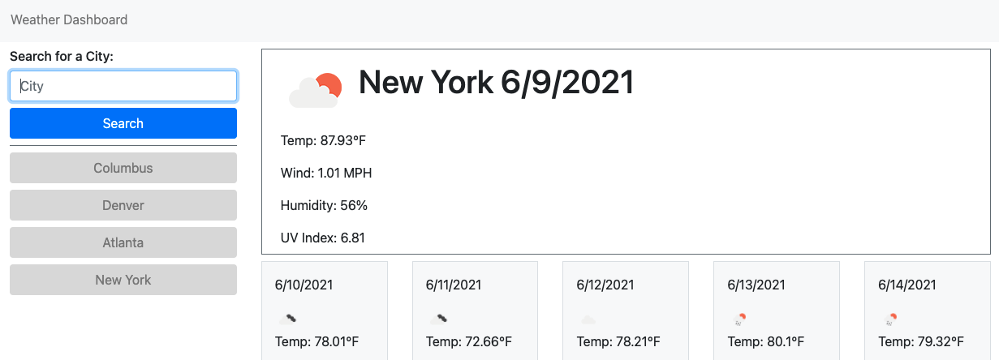

# HOT ENOUGH FOR YA?

## Weather Dashboard

[Live Demo](https://sissyhanks.github.io/hot-enough-for-you/)

Sick of taking last minuit getaways and ending up in locations that are down right cold? This app is designed to give you current weather conditions, as well as a five day forecast, for locations your are thinking about visiting. Each city you search for is added ot the screen so that you may easily click between locations and make a quick comparison. Forecast icons make make it a breeze to see what general conditions will be like each day, and, along with the humidity\* and wind speeds, the temperature for each day is presented so that you may confidently pick a place to visit that will be hot enough for you!

With this project, I got practice making API calls and working with the data returned. I also learned that i need to consider the entire document before working on a single component.

\*This app is is only intended for deciding if a travel destination is, indeed, hot enough for you and is not to be confused with the It's a Dry Heat app.
